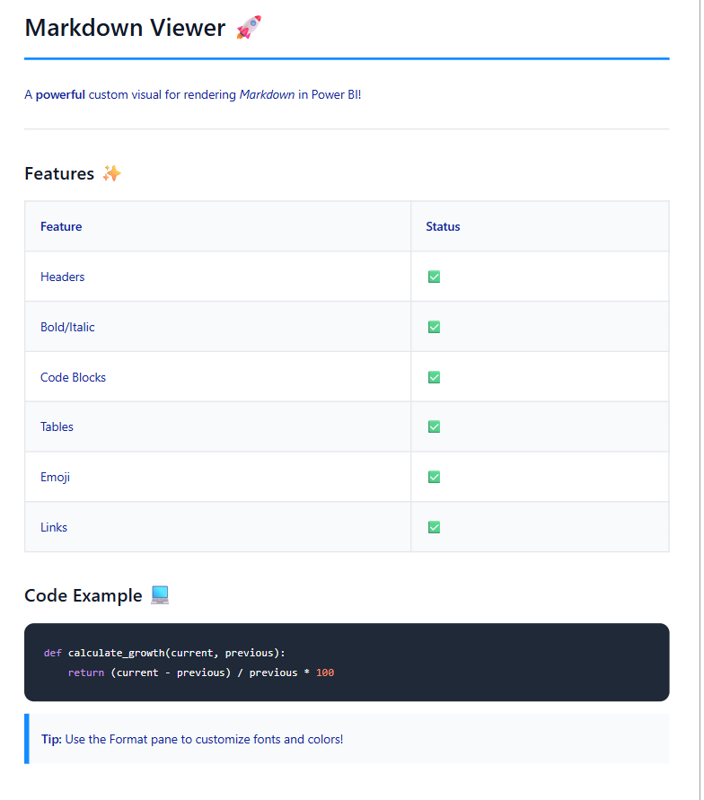
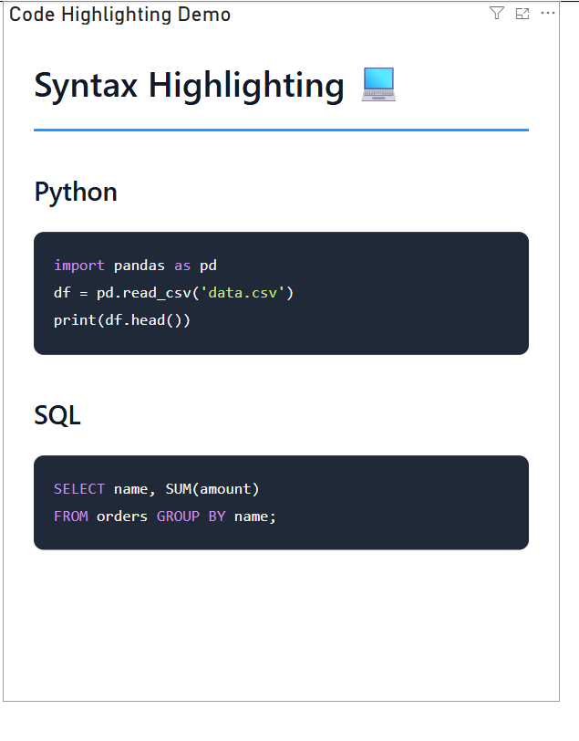
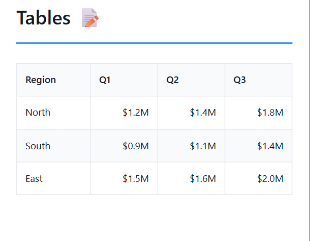
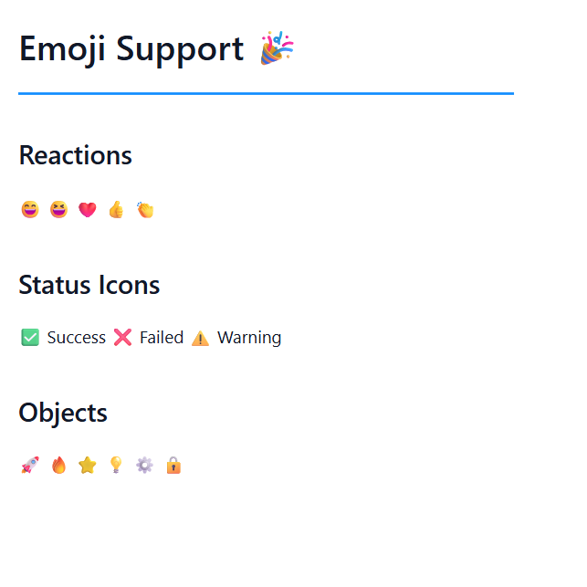
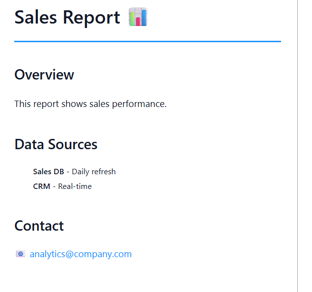

# Atlyn Markdown

A custom Power BI visual that renders Markdown content directly in your reports with GitHub Flavored Markdown support, syntax highlighting, and emoji shortcodes.



## Features

### 📝 Markdown Rendering
Full GitHub Flavored Markdown (GFM) support including headers, bold, italic, lists, links, blockquotes, and more.

### 💻 Syntax Highlighting
Automatic language detection and syntax highlighting for code blocks powered by [highlight.js](https://highlightjs.org/).



### 📊 Table Support
Render clean, formatted tables directly from Markdown syntax.



### 😄 Emoji Support
Convert emoji shortcodes like `:rocket:` to 🚀 — over 60 shortcodes supported.



### 🎨 Customizable Formatting
Adjust the visual appearance through the Power BI Format pane:

| Setting | Description | Default |
|---------|-------------|---------|
| Font Family | Set the typeface | Segoe UI, sans-serif |
| Font Size | Adjust text size (px) | 14 |
| Font Color | Change text color | #111827 |
| Background Color | Set background fill | #FFFFFF |
| Padding | Inner spacing (px) | 20 |
| Show Border | Toggle a rounded border | Off |

## Installation

1. Download the `.pbiviz` file from [Releases](../../releases)
2. In Power BI Desktop, go to the **Visualizations** pane → **…** → **Import a visual from a file**
3. Select the downloaded `.pbiviz` file

## Usage

1. Add the **Atlyn Markdown** visual to your report canvas
2. Create a DAX measure that returns markdown text
3. Drag the measure to the **Markdown Content** field well



### Example DAX Measure

```dax
Report Info = 
VAR NL = UNICHAR(10)
RETURN
"# Sales Report :rocket:" & NL & NL &
"## Overview" & NL &
"This report shows **key metrics** for the quarter." & NL & NL &
"| Metric | Value |" & NL &
"|--------|-------|" & NL &
"| Revenue | $1.2M |" & NL &
"| Growth | 15% |" & NL & NL &
"## Notes" & NL &
"- Data refreshed daily :clock:" & NL &
"- Contact the analytics team for questions :email:"
```

## Supported Emoji

<details>
<summary>Click to expand full emoji list (60+ shortcodes)</summary>

| Shortcode | Emoji | Shortcode | Emoji |
|-----------|-------|-----------|-------|
| `:smile:` | 😄 | `:grinning:` | 😀 |
| `:laughing:` | 😆 | `:joy:` | 😂 |
| `:heart:` | ❤️ | `:star:` | ⭐ |
| `:fire:` | 🔥 | `:thumbsup:` | 👍 |
| `:thumbsdown:` | 👎 | `:clap:` | 👏 |
| `:wave:` | 👋 | `:pray:` | 🙏 |
| `:rocket:` | 🚀 | `:sparkles:` | ✨ |
| `:tada:` | 🎉 | `:confetti_ball:` | 🎊 |
| `:trophy:` | 🏆 | `:medal:` | 🏅 |
| `:check:` | ✅ | `:x:` | ❌ |
| `:warning:` | ⚠️ | `:info:` | ℹ️ |
| `:question:` | ❓ | `:exclamation:` | ❗ |
| `:bulb:` | 💡 | `:memo:` | 📝 |
| `:book:` | 📖 | `:bookmark:` | 🔖 |
| `:link:` | 🔗 | `:gear:` | ⚙️ |
| `:wrench:` | 🔧 | `:hammer:` | 🔨 |
| `:chart:` | 📊 | `:chart_up:` | 📈 |
| `:chart_down:` | 📉 | `:clock:` | 🕐 |
| `:calendar:` | 📅 | `:email:` | 📧 |
| `:phone:` | 📱 | `:computer:` | 💻 |
| `:desktop:` | 🖥️ | `:folder:` | 📁 |
| `:file:` | 📄 | `:lock:` | 🔒 |
| `:unlock:` | 🔓 | `:key:` | 🔑 |
| `:shield:` | 🛡️ | `:bug:` | 🐛 |
| `:zap:` | ⚡ | `:cloud:` | ☁️ |
| `:sun:` | ☀️ | `:moon:` | 🌙 |
| `:earth:` | 🌍 | `:globe:` | 🌐 |
| `:pin:` | 📍 | `:flag:` | 🚩 |
| `:arrow_right:` | ➡️ | `:arrow_left:` | ⬅️ |
| `:arrow_up:` | ⬆️ | `:arrow_down:` | ⬇️ |
| `:plus:` | ➕ | `:minus:` | ➖ |
| `:heavy_check_mark:` | ✔️ | `:white_check_mark:` | ✅ |
| `:eyes:` | 👀 | `:thinking:` | 🤔 |
| `:100:` | 💯 | `:ok:` | 👌 |
| `:point_right:` | 👉 | `:point_left:` | 👈 |

</details>

## Privacy Policy

This visual does **not** collect, store, or transmit any user data. All markdown processing happens entirely within the Power BI environment. See [PRIVACY.md](PRIVACY.md) for full details.

## Support

- **Issues**: [GitHub Issues](../../issues)
- **Email**: atlyn.help@gmail.com

## License

MIT License — see [LICENSE](LICENSE) file.
