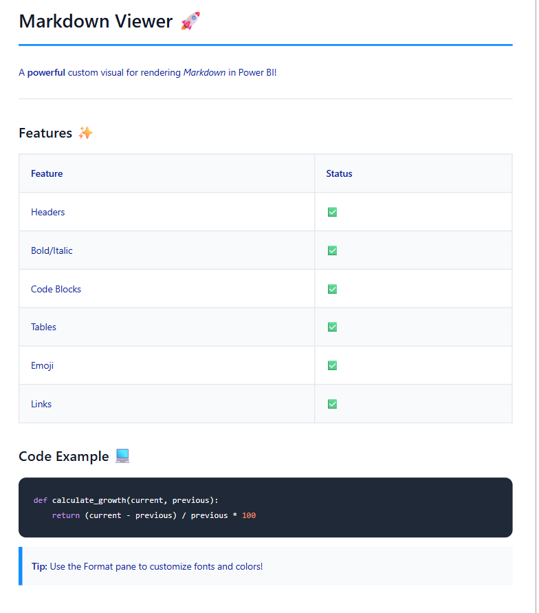
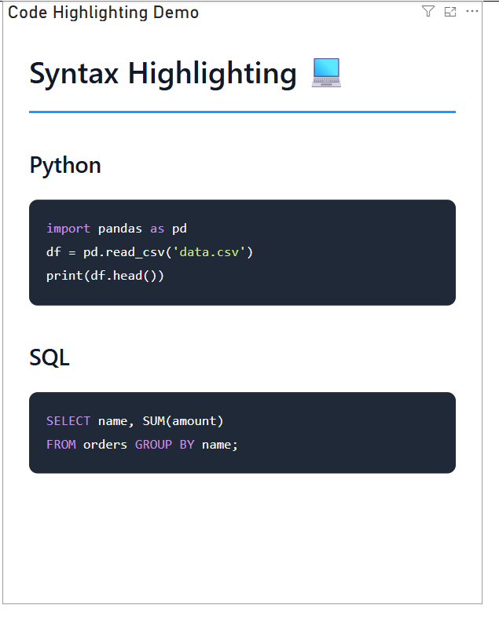
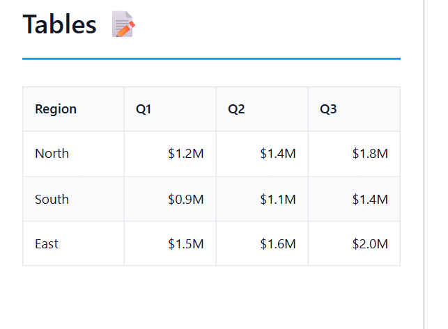
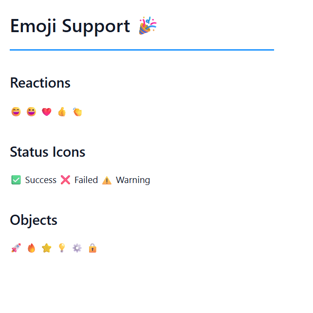
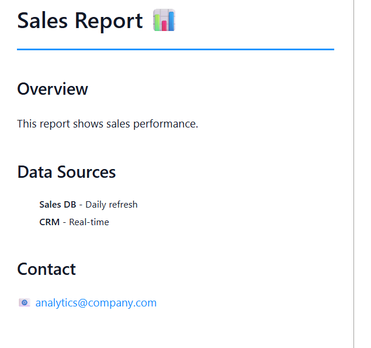

# Atlyn Markdown Viewer

A custom Power BI visual that renders Markdown content directly in your reports with GitHub Flavored Markdown support, syntax highlighting, and emoji shortcodes.



## Features

### 📝 Markdown Rendering
GitHub Flavored Markdown (GFM) patterns including headers, bold, italic, lists, HTTPS links, blockquotes, and more. Raw HTML is sanitized, and remote images or media are not loaded automatically.

### 💻 Syntax Highlighting
Syntax highlighting for JavaScript, TypeScript, JSON, XML, CSS, Markdown, Bash,
Python, SQL, C#, and Java code blocks powered by the core [highlight.js](https://highlightjs.org/)
build. Add a fenced language hint for predictable results; unlabelled blocks use
bounded automatic detection.



### 📊 Table Support
Render clean, formatted tables directly from Markdown syntax.



### 😄 Emoji Support
Convert emoji shortcodes like `:rocket:` to 🚀 — over 60 shortcodes supported. Shortcodes inside inline code, fenced code blocks, and link destinations remain literal.



### 🎨 Customizable Formatting
Adjust the visual appearance through the Power BI Format pane:

| Setting | Description | Default |
|---------|-------------|---------|
| Font Family | Set the typeface | Segoe UI, sans-serif |
| Font Size | Adjust text size (px) | 14 |
| Font Color | Change text color | #111827 |
| Background Color | Set background fill | #FFFFFF |
| Padding | Inner spacing (px) | 20 |
| Show Border | Toggle a rounded border | Off |

The visual also honors Power BI's foreground, background, and hyperlink colors in Windows high-contrast mode.

## Installation

The historical `v1.0.0` package predates the visual's current sanitization and certification hardening and should not be installed. For the certified submission, use a package produced from the exact reviewed source commit:

1. Run `npm ci`
2. Run `npm run certification:validate`
3. In Power BI Desktop, go to the **Visualizations** pane → **…** → **Import a visual from a file**
4. Select `dist/atlynMarkdownViewer.pbiviz`.

The local `npm run certification:validate` command is the certification gate. It
runs lint, type checking, tests, the dependency audit, packaging, and an
artifact-level scan of the embedded visual resource. Hosted CI/CD is not used.

## Usage

1. Add the **Atlyn Markdown Viewer** visual to your report canvas
2. Create a DAX measure that returns markdown text
3. Drag the measure to the **Markdown Content** field well



### Example DAX Measure

```dax
Report Info = 
VAR NL = UNICHAR(10)
RETURN
"# Sales Report :rocket:" & NL & NL &
"## Overview" & NL &
"This report shows **key metrics** for the quarter." & NL & NL &
"| Metric | Value |" & NL &
"|--------|-------|" & NL &
"| Revenue | $1.2M |" & NL &
"| Growth | 15% |" & NL & NL &
"## Notes" & NL &
"- Data refreshed daily :clock:" & NL &
"- Contact the analytics team for questions :email:"
```

The data contract is one **TEXT measure**. If a source value is numeric or date
typed, convert it to Markdown text in DAX (for example with `FORMAT`) before
concatenating it; the visual intentionally does not invent numeric row
formatting.

## Supported Emoji

<details>
<summary>Click to expand full emoji list (60+ shortcodes)</summary>

| Shortcode | Emoji | Shortcode | Emoji |
|-----------|-------|-----------|-------|
| `:smile:` | 😄 | `:grinning:` | 😀 |
| `:laughing:` | 😆 | `:joy:` | 😂 |
| `:heart:` | ❤️ | `:star:` | ⭐ |
| `:fire:` | 🔥 | `:thumbsup:` | 👍 |
| `:thumbsdown:` | 👎 | `:clap:` | 👏 |
| `:wave:` | 👋 | `:pray:` | 🙏 |
| `:rocket:` | 🚀 | `:sparkles:` | ✨ |
| `:tada:` | 🎉 | `:confetti_ball:` | 🎊 |
| `:trophy:` | 🏆 | `:medal:` | 🏅 |
| `:check:` | ✅ | `:x:` | ❌ |
| `:warning:` | ⚠️ | `:info:` | ℹ️ |
| `:question:` | ❓ | `:exclamation:` | ❗ |
| `:bulb:` | 💡 | `:memo:` | 📝 |
| `:book:` | 📖 | `:bookmark:` | 🔖 |
| `:link:` | 🔗 | `:gear:` | ⚙️ |
| `:wrench:` | 🔧 | `:hammer:` | 🔨 |
| `:chart:` | 📊 | `:chart_up:` | 📈 |
| `:chart_down:` | 📉 | `:clock:` | 🕐 |
| `:calendar:` | 📅 | `:email:` | 📧 |
| `:phone:` | 📱 | `:computer:` | 💻 |
| `:desktop:` | 🖥️ | `:folder:` | 📁 |
| `:file:` | 📄 | `:lock:` | 🔒 |
| `:unlock:` | 🔓 | `:key:` | 🔑 |
| `:shield:` | 🛡️ | `:bug:` | 🐛 |
| `:zap:` | ⚡ | `:cloud:` | ☁️ |
| `:sun:` | ☀️ | `:moon:` | 🌙 |
| `:earth:` | 🌍 | `:globe:` | 🌐 |
| `:pin:` | 📍 | `:flag:` | 🚩 |
| `:arrow_right:` | ➡️ | `:arrow_left:` | ⬅️ |
| `:arrow_up:` | ⬆️ | `:arrow_down:` | ⬇️ |
| `:plus:` | ➕ | `:minus:` | ➖ |
| `:heavy_check_mark:` | ✔️ | `:white_check_mark:` | ✅ |
| `:eyes:` | 👀 | `:thinking:` | 🤔 |
| `:100:` | 💯 | `:ok:` | 👌 |
| `:point_right:` | 👉 | `:point_left:` | 👈 |

</details>

## Privacy Policy

This visual does **not** collect, store, or automatically transmit user data. Markdown processing happens entirely within the Power BI environment. Choosing an HTTPS link opens that destination through the Power BI host. See [PRIVACY.md](PRIVACY.md) for full details.

## Limits, Localization, and Export

The visual supports headings, paragraphs, emphasis, lists, blockquotes, tables,
details/summary, code, emoji shortcodes, and absolute HTTPS links. Raw HTML is
restricted to the same safe document elements. Images, media, SVG, scripts,
styles, forms, embedded content, relative links, and non-HTTPS links are
removed or shown as unsupported text. Unsupported links are inert and visibly
annotated; they never use native browser navigation.

For predictable performance, documents are limited to 250,000 characters, 100
fenced code blocks, and 20,000 characters per block. Unlabelled automatic
highlighting is limited to 8,000 characters; exceeding a limit shows an
accessible error instead of silently truncating content. Tables use a
focusable horizontal-overflow wrapper while retaining native table semantics.

The package includes an en-US baseline and es-ES resources. The visual follows
the host locale for localized owned strings and RTL direction (including
Arabic, Hebrew, Persian, Urdu, and related RTL locales). Markdown content
itself remains user-authored text.

Power BI PDF and PowerPoint export starts at the visual's default/top scroll
position and captures the visible visual viewport, not an arbitrarily long
document. For long documents, size the visual to the intended export area or
split documentation across report pages. The visual has no structured rows, so
row selection state, cross-filter/highlight, row tooltips, drill, expand,
sort/filter APIs, and categorical/table/matrix mappings are not applicable.
The existing single-measure context menu remains supported.

## Support

- **Issues**: [GitHub Issues](../../issues)
- **Email**: atlyn.help@gmail.com

## License

MIT License — see [LICENSE](LICENSE) file.
